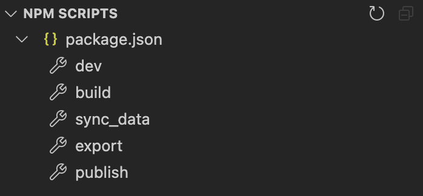

# http://xzhou.me on `react.js`


## Installing dev environment
1. Install Homebrew following [this page](https://brew.sh/).
2. Install Node.js with `brew install node`.
3. Running `npm install` in the root directory of this repo.

Using USTC mirror for homebrew and npm:
```bash
# homebrew
cd "$(brew --repo)"
git remote set-url origin https://mirrors.ustc.edu.cn/brew.git

# homebrew cask
cd "$(brew --repo)"/Library/Taps/homebrew/homebrew-cask
git remote set-url origin https://mirrors.ustc.edu.cn/homebrew-cask.git

# npm
cat "registry=http://npmreg.mirrors.ustc.edu.cn/" >> ~/.npmrc
```

## Development
1. Open this repository with VSCode (install with `brew install --cask visual-studio-code`). 
2. Locate the NPM SCRIPTS in the bottom-left corner.

3. Click `sync_data` to sync publication information with `xzhou.me-pub-info`.
4. Click `dev` to start the development environment.

Open [http://localhost:3000](http://localhost:3000) with your browser to see the preview of the webpage.
## Publish
1. Edit server information in `publish.sh`.
2. Click `publish` in NPM SCRIPTS to complete the build, export and sync operations.

## Learn More

To learn more about Next.js, take a look at the following resources:

- [Next.js Documentation](https://nextjs.org/docs) - learn about Next.js features and API.
- [Learn Next.js](https://nextjs.org/learn) - an interactive Next.js tutorial.

You can check out [the Next.js GitHub repository](https://github.com/vercel/next.js/) - your feedback and contributions are welcome!
